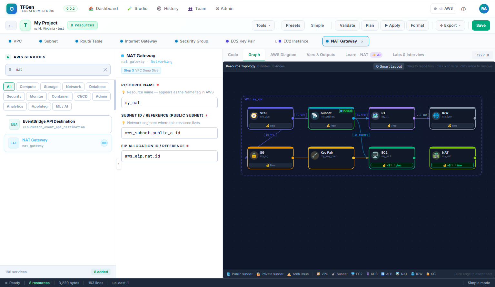
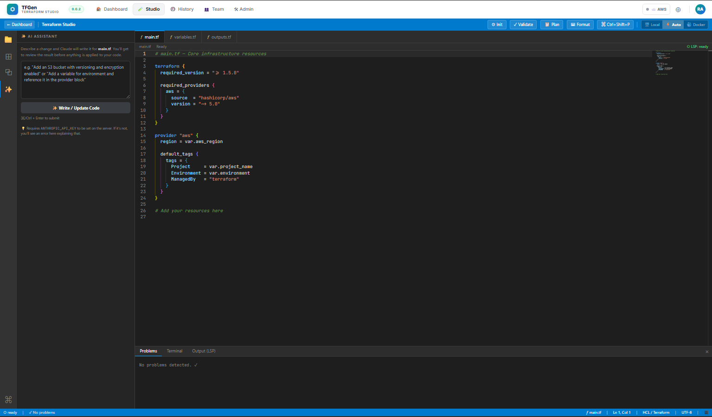
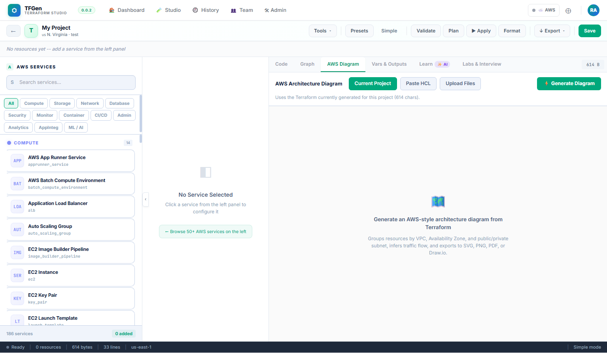
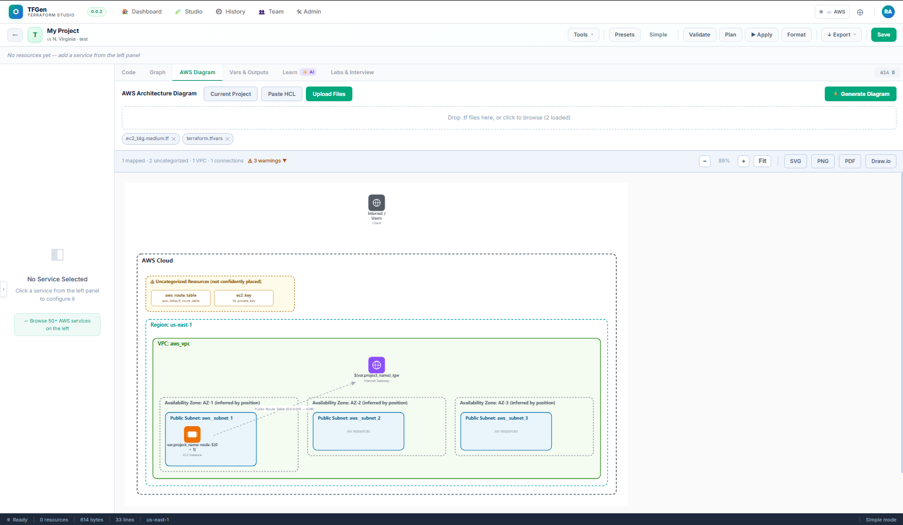
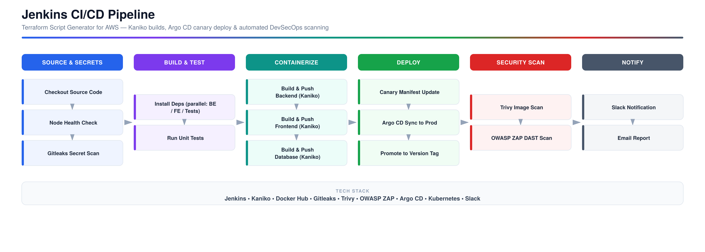
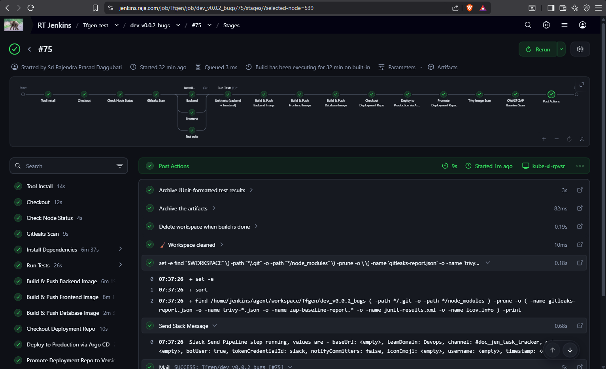
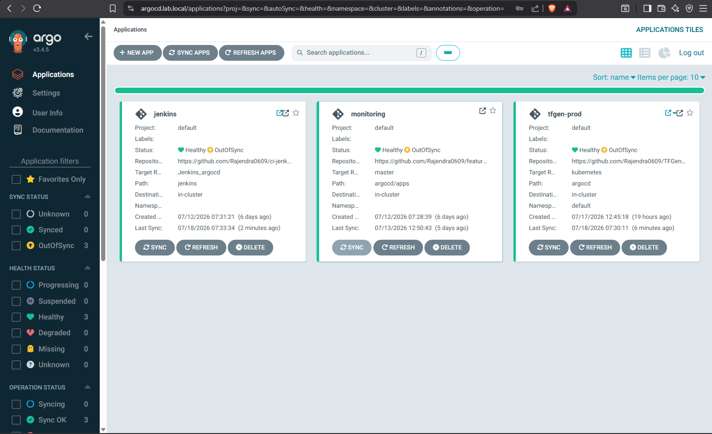
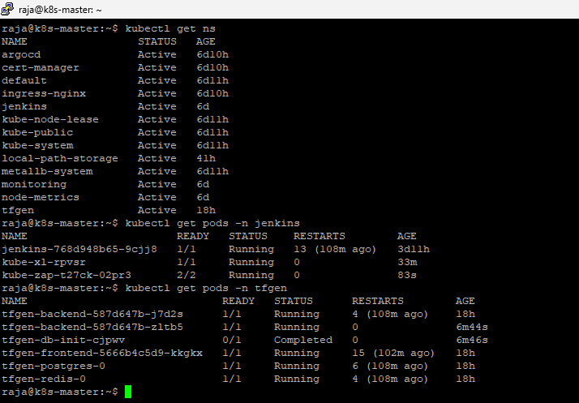

# TFGen — AI-Assisted Terraform Studio for AWS

TFGen is a Terraform Studio for AWS: pick services visually, let an AI assistant write the HCL, see the architecture as a diagram, and ship the result through an automated CI/CD pipeline — all in one place.

**Status:** `v0.0.2` · actively developed, solo project.

---

## Table of Contents

- [Overview](#overview)
- [Features](#features)
  - [1. Visual Resource Builder](#1-visual-resource-builder)
  - [2. AI-Assisted Terraform Authoring](#2-ai-assisted-terraform-authoring)
  - [3. Auto-Generated Architecture Diagrams](#3-auto-generated-architecture-diagrams)
- [CI/CD & Deployment Pipeline](#cicd--deployment-pipeline)
  - [Pipeline Stages](#pipeline-stages)
  - [Live in Production](#live-in-production)
- [Tech Stack](#tech-stack)
- [Project Status](#project-status)

---

## Overview

Writing AWS infrastructure by hand — blank `.tf` files, memorized resource blocks, manually keeping a diagram in sync with the code — is slow and repetitive. TFGen wraps that workflow into a single studio:

**Design → Code → Visualize → Ship.**

Everything below is a real screenshot of the tool running against the `us-east-1` region, plus the pipeline that deploys TFGen itself to a home Kubernetes lab.

---

## Features

### 1. Visual Resource Builder

Choose from a catalog of 186+ AWS services and wire them together visually. TFGen renders a live **resource topology graph** as resources are added, complete with per-resource AWS free-tier cost estimates (e.g. NAT Gateway, EC2, VPC, IGW, Route Table, Security Group, Key Pair).

### 2. AI-Assisted Terraform Authoring

Describe an infrastructure change in plain English and a built-in AI assistant writes the HCL directly into `main.tf`. Nothing is applied automatically — every change is written to the editor for review first.

### 3. Auto-Generated Architecture Diagrams

One click turns the current Terraform into an AWS-style architecture diagram — grouped by VPC, Availability Zone, and public/private subnet, with inferred traffic flow. Diagrams export to SVG, PNG, PDF, or draw.io.

| Before — empty canvas | After — generated diagram |
|---|---|
|  |  |

---

## CI/CD & Deployment Pipeline

TFGen doesn't just design infrastructure — it deploys itself. Every commit runs through a Jenkins pipeline that builds, scans, and ships the app to a home Kubernetes cluster via Argo CD (GitOps, canary rollout, then promote).

*(Editable diagram source: [`docs/images/cicd-pipeline-overview.drawio`](docs/images/cicd-pipeline-overview.drawio), open in [app.diagrams.net](https://app.diagrams.net))*

### Pipeline Stages

| Phase | What happens |
|---|---|
| **Source & Secrets** | Checkout, a node health check, then a [Gitleaks](https://github.com/gitleaks/gitleaks) scan that flags any secret committed to the repo |
| **Build & Test** | Backend, frontend, and test-suite dependencies install in parallel; unit tests run before anything is packaged |
| **Containerize** | [Kaniko](https://github.com/GoogleContainerTools/kaniko) builds and pushes the backend, frontend, and database images — rootless, no Docker daemon required on the build agent |
| **Deploy** | Deployment manifests update for a canary rollout, Argo CD syncs to the Kubernetes cluster, and once the app reports healthy the change is promoted to the release tag |
| **Security Scan** | [Trivy](https://github.com/aquasecurity/trivy) scans every pushed image for CVEs; [OWASP ZAP](https://www.zaproxy.org/) runs a live DAST baseline scan |
| **Notify** | Slack and email get the result — commit, failing stage (if any), and links to every scan report |

### Live in Production

`tfgen-prod` is deployed and healthy, running alongside the `jenkins` and `monitoring` apps on the same cluster.

| Jenkins — pipeline run, all stages green | Argo CD — `tfgen-prod` healthy | `kubectl` — pods running in-cluster |
|---|---|---|
|  |  |  |

---

## Tech Stack

**App / IaC:** Terraform · AWS

**CI/CD & GitOps:** Jenkins · Kaniko · Docker Hub · Argo CD · Kubernetes

**Security:** Gitleaks · Trivy · OWASP ZAP

**Notifications:** Slack · Email

---

## Project Status

TFGen is an early-stage (`v0.0.2`), solo-built project — a way to get real, end-to-end hands-on practice with Terraform, AWS, and GitOps rather than just reading about them. Expect rough edges; feedback and issues are welcome.
